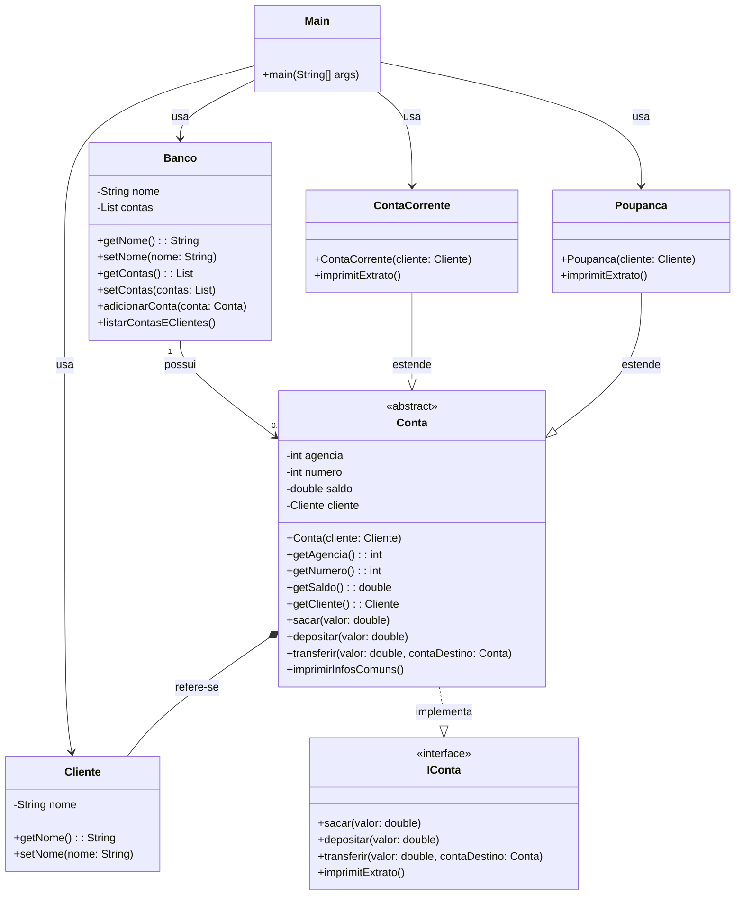

# ContaBanco

##**Diagrama de Classes**

##**Detalhamento das Classes**

##**Projeto Banco Simples**
Este projeto é uma simulação de um sistema bancário simples em Java, utilizando a biblioteca Lombok para reduzir o código boilerplate. O sistema inclui funcionalidades básicas de uma conta bancária, como depósito, saque, transferência e impressão de extrato. Além disso, permite listar todas as contas e seus respectivos clientes.

##**Estrutura do Projeto**
O projeto é composto pelas seguintes classes e interfaces:

##**Classe Main**
A classe Main é responsável por iniciar a aplicação. Ela cria instâncias de Cliente, ContaCorrente, Poupanca e Banco, realiza operações de depósito e transferência, e imprime os extratos das contas.
