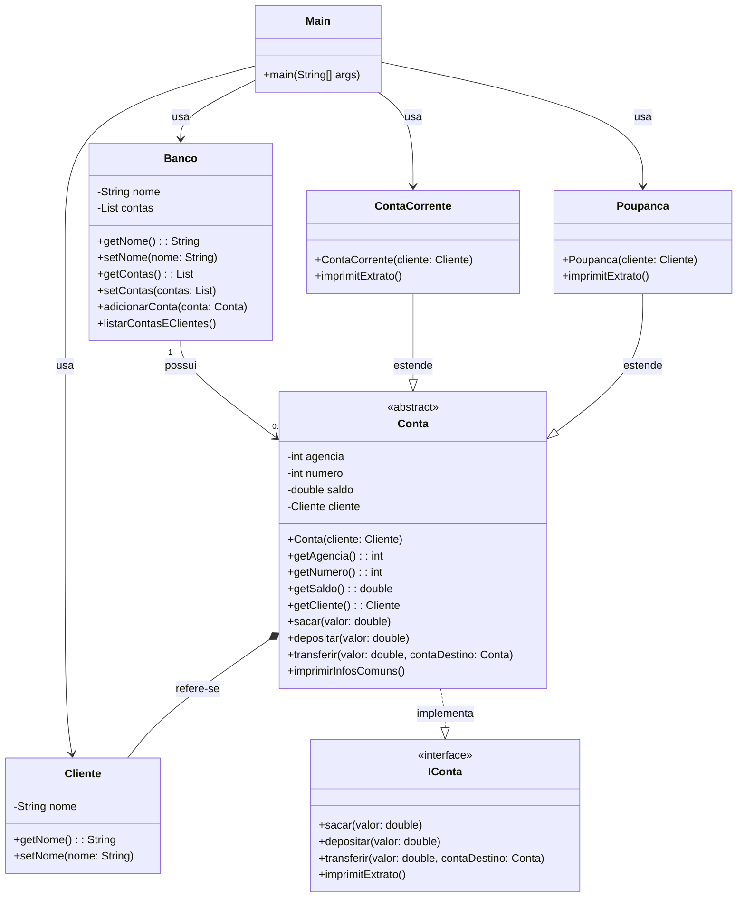

# ContaBanco

##**Diagrama de Classes**

##**Detalhamento das Classes**

**Projeto Banco Simples**
Este projeto é uma simulação de um sistema bancário simples em Java, utilizando a biblioteca Lombok para reduzir o código boilerplate. O sistema inclui funcionalidades básicas de uma conta bancária, como depósito, saque, transferência e impressão de extrato. Além disso, permite listar todas as contas e seus respectivos clientes.

**Estrutura do Projeto**
O projeto é composto pelas seguintes classes e interfaces:

**Classe Main**
A classe Main é responsável por iniciar a aplicação. Ela cria instâncias de Cliente, ContaCorrente, Poupanca e Banco, realiza operações de depósito e transferência, e imprime os extratos das contas.

**Classe Banco**
A classe Banco gerencia as contas do banco. Ela possui métodos para adicionar contas e listar todas as contas e seus clientes.

**Classe Cliente**
A classe Cliente representa o cliente do banco. Ela possui um atributo nome e métodos para obter e definir o nome.

**Classe Conta**
A classe Conta é uma classe abstrata que define os atributos e métodos comuns a todas as contas bancárias. Ela implementa a interface IConta. Além dos atributos básicos (agencia, numero, saldo, cliente), a classe Conta possui os seguintes campos adicionais:

**tipoConta**: Identifica o tipo de conta (e.g., Corrente, Poupança, Investimento).
**dataAbertura**: Armazena a data em que a conta foi aberta.
**statusConta**: Indica o status da conta (e.g., Ativa, Inativa, Encerrada).
**historicoTransacoes**: Lista que armazena todas as transações realizadas na conta.
**limiteChequeEspecial**: Define um limite para o cheque especial.
**jurosMensais**: Taxa de juros aplicada mensalmente à conta.
**chavePix**: Chave PIX associada à conta para transferências instantâneas.
**Classe ContaCorrente**
A classe ContaCorrente estende a classe Conta e adiciona um método para imprimir o extrato da conta corrente.

**Classe Poupanca**
A classe Poupanca estende a classe Conta e adiciona um método para imprimir o extrato da conta poupança.

**Interface IConta**
A interface IConta define os métodos que devem ser implementados pelas classes de conta.

**Classe Transacao**
A classe Transacao representa uma transação realizada na conta. Ela possui os seguintes atributos:

**tipo**: Tipo da transação (e.g., Saque, Depósito, Transferência).
**valor**: Valor da transação.
**dataHora**: Data e hora da transação.
**Dependências**
**Lombok**
Este projeto utiliza Lombok para reduzir a quantidade de código boilerplate.
